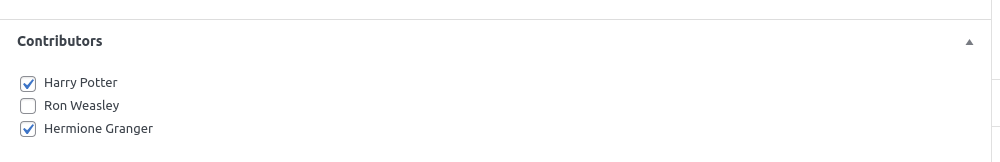

# WordPress Post Contributors Plugin by Shailesh

## The following files are being used for all plugin functionalities
```
├── assets
│   └── css
│       └── frontend
│           └── post-contributors-list.css
├── includes
│   ├── admin
│   │   └── class-post-contributors-metabox.php
│   ├── controller
│   │   └── class-post-contributors.php
│   ├── frontend
│   │   └── class-post-contributors-display.php
│   └── class-init.php
├── templates
│   └── frontend
│       └── post-contributors-list.php
├── shvsh-post-contributors.php
└── uninstall.php
```

## Filters

```php
//loc: includes/admin/class-post-contributors-metabox.php
/**
 * This filter can be used to change who can have the access to configure the post contributors.
 *
 * @param bool $has_access True if user has access, false otherwise.
 * @param int $user_id User Id.
 * @param int $post_id Post Id.
 */
apply_filters( 'shvsh_has_post_contributors_configuration_access', $has_access, $user_id, $post_id );
```

```php
//loc: includes/admin/class-post-contributors-metabox.php
/**
 * This filter can be used to modify the post contributors.
 *
 * @param array $post_contributors_ids The post contributors ids.
 * @param int $post_id The post id.
 */
apply_filters( 'shvsh_post_contributors_from_post_request', $post_contributors_ids, $post_id );
```

<hr />
<h4>Steps</h4>
<hr />

*Step 1 - Go to Post Edit Page*

*Step 2 - Select the Post Contributors*


*Step 3 - Update the Post*

*Step 4 - That's it. View the Post Contributors on Your Post :thumbsup:*

